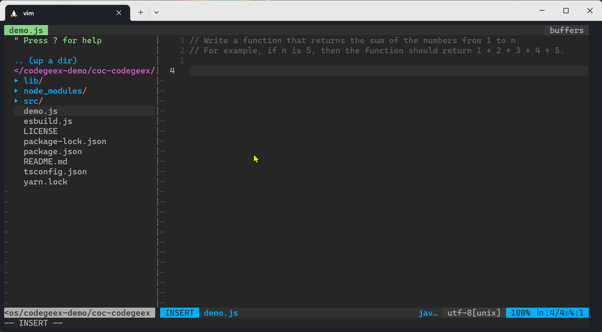

# coc-codegeex

[codegeex][codegeex] in vim using [coc.nvim][coc.nvim]



## Install

first install [coc.nvim][coc.nvim]

and in vim install plugin: coc-codegeex `:CocInstall coc-codegeex`

## Usage

### setup

use `:CocConfig` open configuration file, add `apiKey` and `apiSecret`. You can apply this in [tianqi][tianqi]

```
{
  "codegeex": {
    "apiKey": "your_api_key",
    "apiSecret": "your_api_secret",
  }
}
```

### stealth mode

when you stop type, you will see the completion list. use `Enter` to confirm selection, the selected code will be inserted.

### translation mode

set keymap in .vimrc

`vmap <silent> <C-l> <Plug>(coc-codegeex-translate-keymap)`

in vim visual mode, select some code and use `ctrl + l` to trigger translation.

## License

MIT

---

> This extension is built with [create-coc-extension](https://github.com/fannheyward/create-coc-extension)

[codegeex]: https://codegeex.ai/
[coc.nvim]: https://github.com/neoclide/coc.nvim
[tianqi]: https://tianqi.aminer.cn/open/
